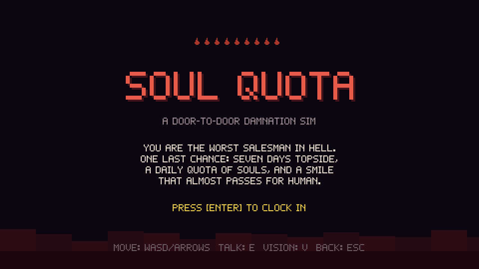
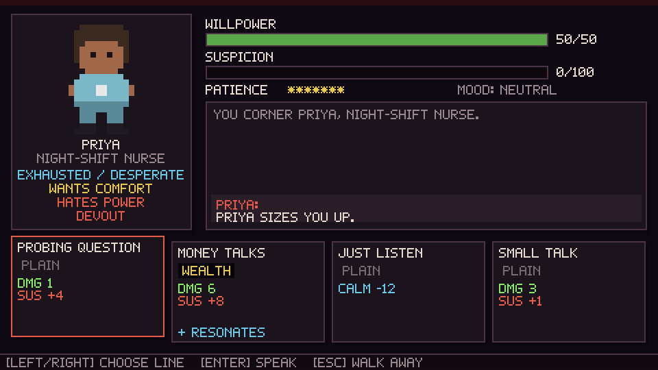
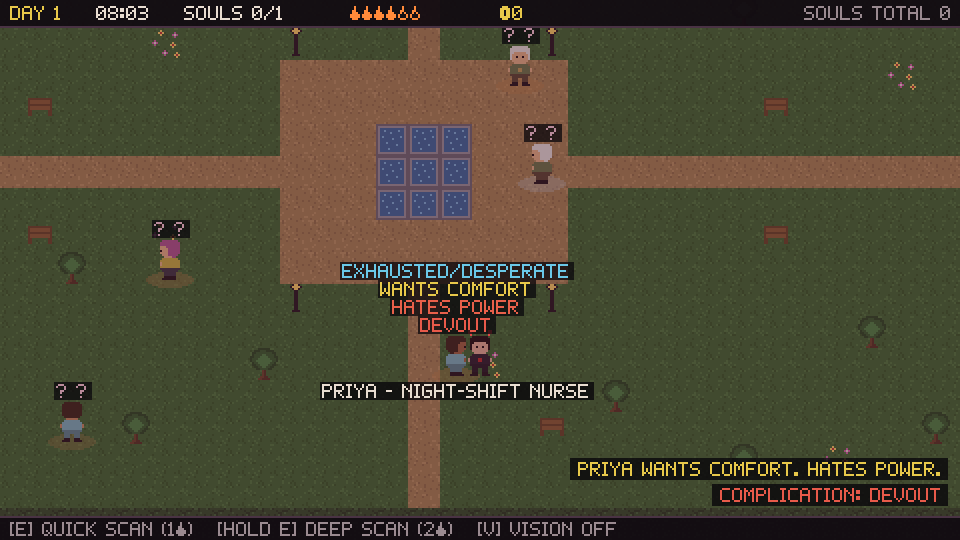
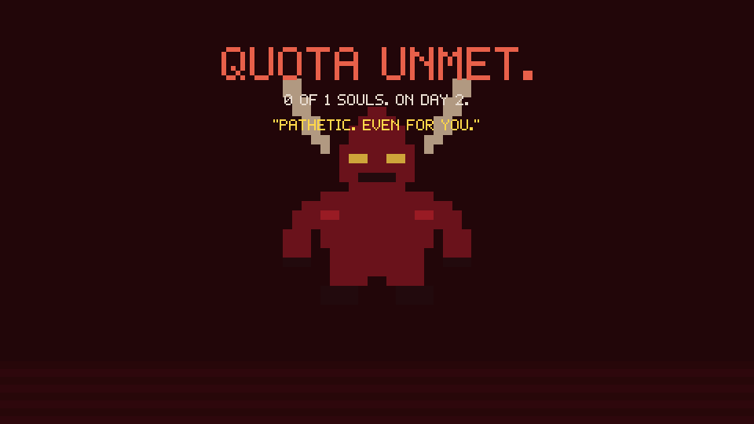

# SOUL QUOTA

*A door-to-door damnation sim.*

You are the worst salesman in Hell, shipped topside on a performance-improvement plan. Seven days. A daily quota of souls. A smile that almost passes for human. Scan the living with Demon Vision, find the hole in their life, and talk them into signing it away — without tipping them off that you are not, strictly speaking, a person.

Miss quota and the Boss comes to collect *you*.






## Run it

```sh
npm install
npm run dev      # play at the printed localhost URL
npm test         # 32 sim + headless-playthrough tests
npm run build    # typecheck + production bundle (~27 KB gzipped)
```

## Controls

| Key | Action |
| --- | --- |
| WASD / Arrows | Move |
| V | Toggle Demon Vision |
| E (in vision, near a mark) | Quick scan — 1 Hellfire, reveals 2 traits |
| Hold E (in vision) | Deep scan — 2 Hellfire, reveals Desire, Ick, and quirks |
| E (vision off, near a mark) | Open a Soul-Bargain |
| Left/Right + Enter (in bargain) | Choose and speak a line |
| Esc | Walk away / back |
| E on the glowing manhole | End the day early |

## The loop

1. **Morning** — pick a district. Soft marks in Murkwell Commons, drunks at The Stoop, fat high-suspicion souls in Gildport Financial.
2. **The street** — the clock runs 8:00→20:00. Demon Vision and scans burn **Hellfire**, your daily energy. Scouting before pitching is almost always worth it.
3. **The Soul-Bargain** — chip their **Willpower** to 0 before **Suspicion** hits 100 or their **Patience** runs out. Match card keywords to scanned traits (1.75x), to their deep **Desire** (3x), and never to their **Ick** (zero damage, suspicion spike, they get offended).
4. **20:00 quota check** — make quota and visit the **Underworld Commissary**: cursed charms, stronger lines for your deck, consumables. Miss it and Satan personally escorts you to the results screen.
5. **Death is a demotion** — failed runs still bank **Sin Points** for permanent upgrades in the Orientation Pit. Survive all seven days for the promotion ending.

Fled marks spread rumors (+10 starting suspicion for the rest of the day). Every charm helps *and* hurts — read the curse before you buy.

## Tech

No engine, no assets: TypeScript + Vite + a hand-rolled canvas engine.

- 480x270 pixel buffer, integer-upscaled, `image-rendering: pixelated`
- Every sprite and the 5x7 bitmap font are string-grid pixel art defined in code
- All SFX synthesized with WebAudio oscillators — zero binary files in the repo
- Renderer/audio/storage sit behind interfaces, so the **entire game runs headless**: the test suite boots the real game, walks the street, deep-scans a mark, plays a full bargain, and gets dragged to Hell — no browser required
- Deterministic seeded RNG end to end (runs, populations, shops are reproducible)

```
src/
  engine/   loop-agnostic core: renderer (canvas + null), bitmap font,
            input actions, WebAudio synth, seeded RNG, scene stack
  game/
    data/   cards, charms, traits, archetypes, districts, upgrades, sprites
    sim/    pure logic: bargain engine, NPC gen, run/day state, shop, meta save
    scenes/ title, pit, city map, overworld, bargain, commissary, day end, run end
  tests/    sim unit tests + full headless playthrough
scripts/    playwright-core capture scripts (drive headless Edge for screenshots)
```

See [DESIGN.md](DESIGN.md) for the full design and the roadmap.
